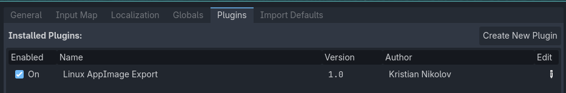
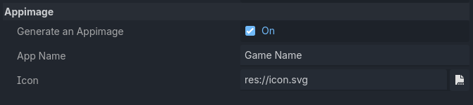

# Linux AppImage Export Godot Addon

This is a Godot 4 export plugin for exporting a game as a Linux AppImage.

## Prerequisites

- A Linux device
- [appimagetool](https://github.com/AppImage/appimagetool/releases). Put it on
  `PATH`, in `~/.local/bin`, `~/Applications`, or `~/AppImages`, or select it in
  **Project > Project Settings > AppImage Export > Appimagetool Path**. Make the
  downloaded file executable first (for example,
  `chmod +x appimagetool-x86_64.AppImage`).

## How to use
1. Make sure the plugin is installed and enabled

2. Create a Linux preset, enable **Generate An Appimage**, and fill in the
   AppImage name, description, and PNG or SVG icon. Optionally provide
   semicolon-separated MIME types and desktop `Exec` arguments such as `%F`
   for applications that open files. The plugin supports both embedded and
   separate PCK exports.

3. Export. The `.AppImage` is created beside the exported Linux executable.
